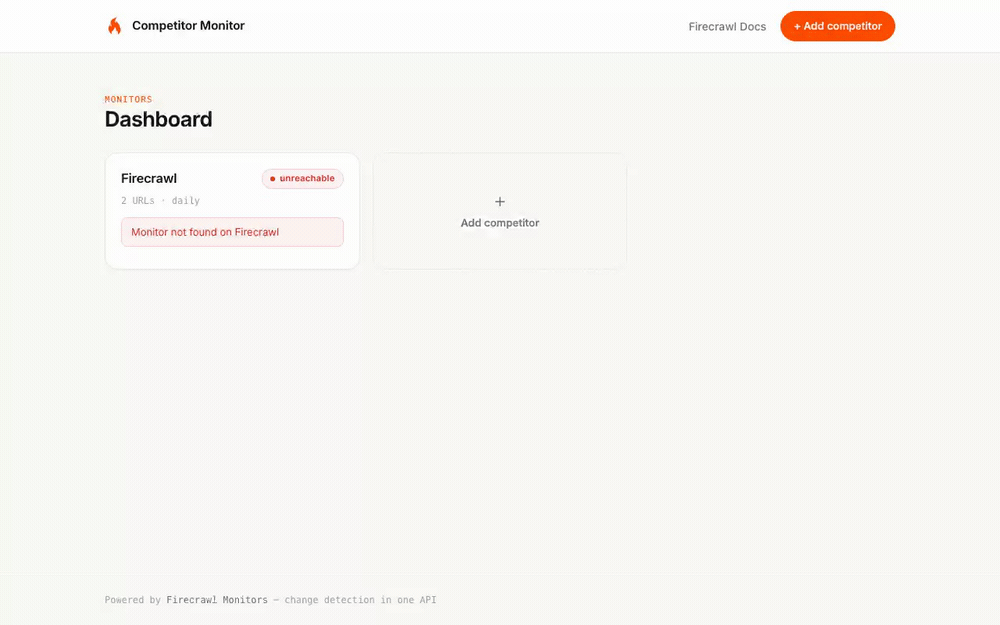
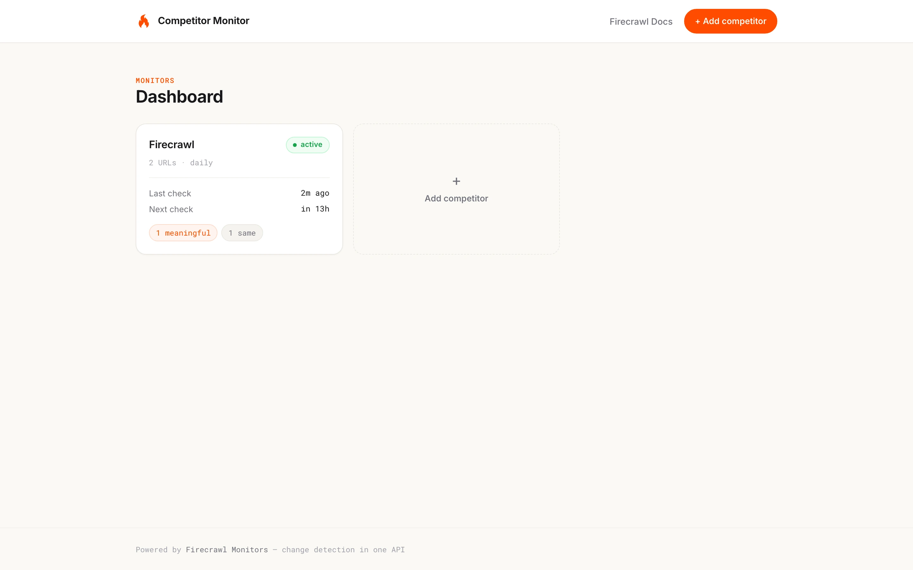
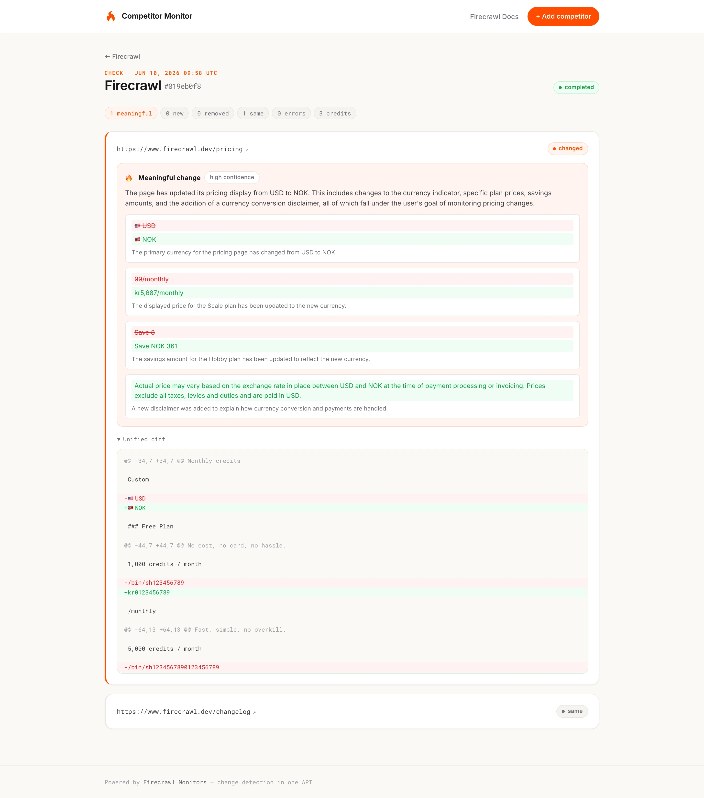
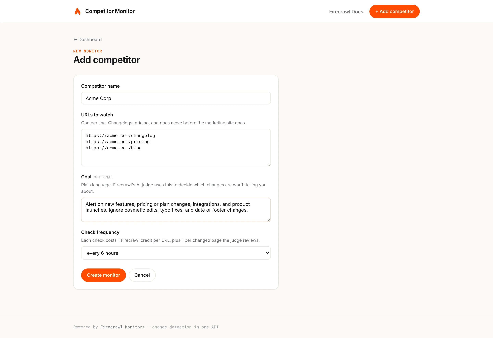

# Competitor Monitor

A small dashboard that watches your competitors' websites for you, built on
[Firecrawl Monitors](https://docs.firecrawl.dev/features/monitoring). You add
a competitor, paste the URLs worth watching (changelog, pricing, docs), write
one sentence about what you care about, and an AI judge tells you when
something that matters actually changes. Typo fixes and rotating page noise
never page you.



Firecrawl does all the heavy lifting (scheduling, scraping, diffing, judging).
This app is the thin dashboard on top: Flask, SQLite, one CSS file, no build
step.



## Run it

You need a [Firecrawl API key](https://www.firecrawl.dev) and a recent
Python 3 (built on 3.14). Then it's copy-paste:

```bash
git clone https://github.com/ninadpathak/firecrawl-competitor-monitor.git
cd firecrawl-competitor-monitor
python3 -m venv .venv
.venv/bin/pip install -r requirements.txt
echo "FIRECRAWL_API_KEY=fc-your-key-here" > .env
.venv/bin/python app.py
```

Swap in your real key on the `echo` line, then open
**http://127.0.0.1:5050** and add your first competitor.

To update to the latest version later:

```bash
git pull
.venv/bin/pip install -r requirements.txt
```

## What you get

Adding a competitor creates one Firecrawl monitor that re-scrapes every URL
on your schedule and diffs it against the last snapshot. Pages come back as
`same`, `changed`, `new`, `removed`, or `error`, and because every monitor
carries a plain-language goal, Firecrawl's AI judge reads each changed page
and decides whether it's meaningful or noise, with a written reason.



The dashboard leads with the judge's verdict, not the raw diff count. A page
that "changed" because of a rotating CAPTCHA token shows up as a quiet gray
"noise filtered" chip; a real pricing change shows up orange.



## How it stays fast and under the rate limit

Firecrawl's free plan allows about 3 API requests per minute, and a live API
round trip takes close to a second. The app deals with both: every page is
served instantly from a SQLite-backed cache (stale-while-revalidate, refreshed
in a background thread), one shared `list_monitors` call covers the whole
dashboard, write responses seed the cache so nothing gets fetched twice, and
a global cooldown gate stops all outbound traffic the moment a 429 arrives.
Page loads run ~2ms.

Monitors also pin `scrapeOptions.location.country` to `US` by default. Scrape
requests route through a proxy pool, and without a pinned region a
geo-localized page (currency, language) diffs as "changed" when nothing real
happened.

## Project layout

| File | What it does |
| --- | --- |
| `app.py` | Flask routes, the SWR cache, the rate-limit gate, judge-aware verdicts |
| `firecrawl_client.py` | Thin wrapper over the Firecrawl v2 Monitor REST API |
| `db.py` | SQLite: competitor → monitor mapping plus the API response cache |
| `templates/` | Server-rendered Jinja pages (`_flame.svg` is Firecrawl's animated mark) |
| `static/style.css` | Firecrawl design language: `#ff4d00`, warm whites, Inter + Roboto Mono |

## Costs and limits

Monitors have no separate fee: each check costs 1 credit per URL, plus 1 per
changed page the judge reviews. A 2-URL daily monitor estimates 120 credits a
month, and the app shows Firecrawl's `estimatedCreditsPerMonth` for every
competitor. Minimum check interval is 15 minutes; snapshots are retained 30
days by default (up to 365).

Want pushes instead of polling? Add a `webhook` or `notification.email` block
in `firecrawl_client.py:create_monitor` — see the
[notification docs](https://docs.firecrawl.dev/features/monitoring#notifications).
